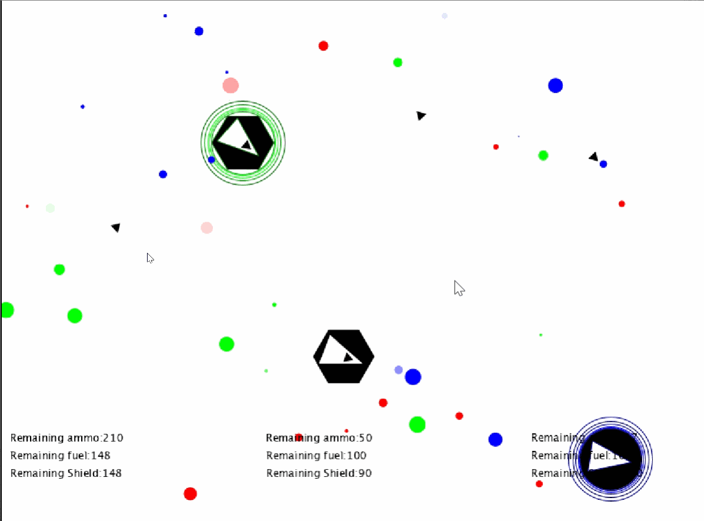
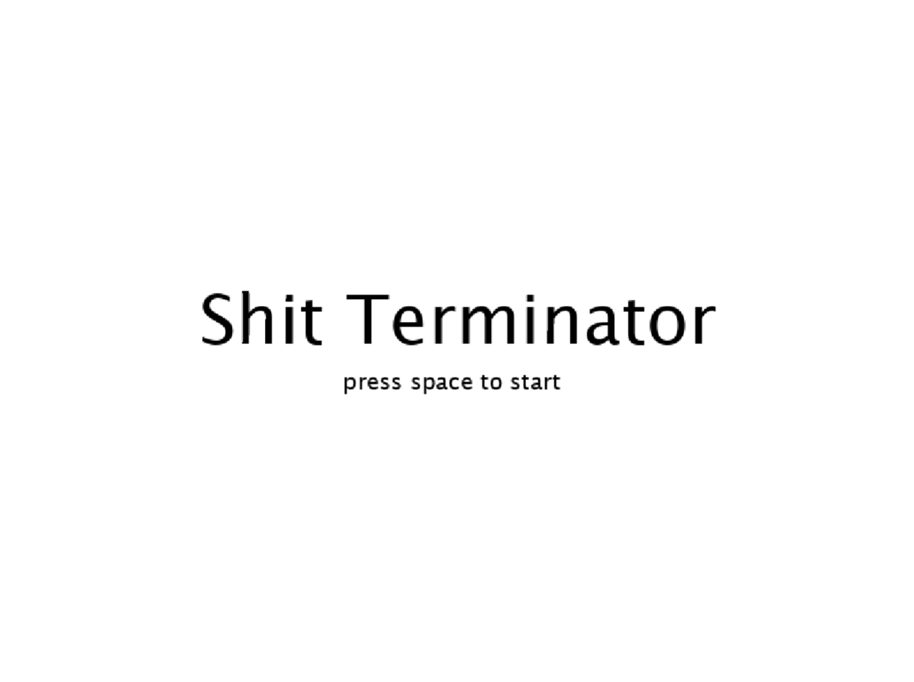
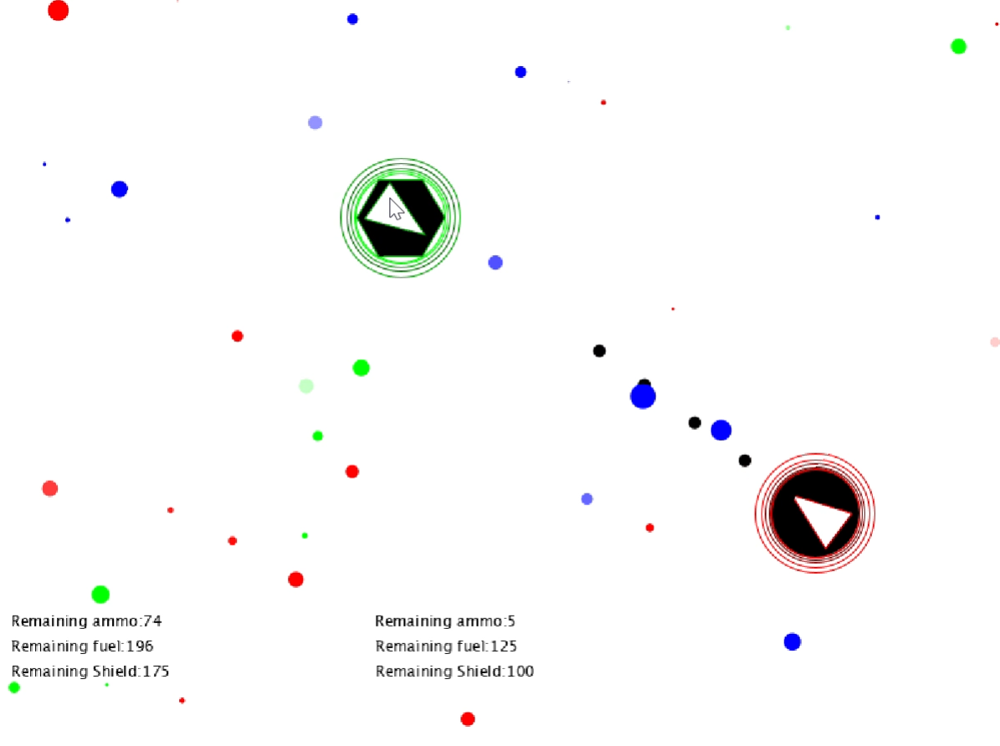
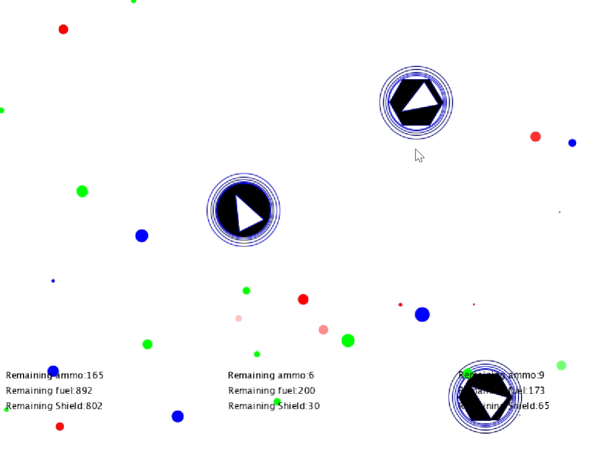

# Angin - Shit Terminator

与女朋友**合写**的毕设小游戏 

## 代码架构:

ECS编程范式的第一次尝试, 还融合了DDD的思想, 这些知识是通过文章 [DDD系列第四讲：领域层设计规范](https://blog.csdn.net/Taobaojishu/article/details/111878209) 学到的

## 文件组织:

由于完成仓促, 文件组织尚需完善

1. entity 里面是游戏里所有的实体
2. draw 里面是游戏动画效果的相关代码, 不包含游戏逻辑
3. enums 所有的枚举类型
4. system 游戏中多个实体之间交互的逻辑
5. Main 程序入口

## 项目构建与依赖:

使用Maven构建, 仅使用了提供图形界面的processing.core包和简化编程的lombok, 无本地依赖

## 玩法:

1. 我方飞船为圆形外壳, 敌方飞船为六边形外壳
2. WASD控制己方飞船移动, 鼠标移动控制射击方向, 鼠标左键射击
3. 地图中随机出现3种颜色的资源, 分别代表子弹(红色), 护盾(蓝色), 燃料(绿色), 资源半径越大,代表其资源越多, 所有资源都在随机时间(<10s)后消失不见
4. 飞船经过资源上方均可以吸收资源, 飞船被击中后会减少护盾, 飞船移动会减少燃料(未实现), 飞船射击会减少子弹.
5. 所有敌方飞船护盾小于0则玩家获胜, 玩家护盾小于0则玩家失败

## 游戏流程:

1. 入口界面:
   
   
2. 第一关:一个敌方飞船

   

3. 第二关:两个敌方飞船

   

## 敌方飞船移动模型:

1. 完全碰撞模型: 敌方飞船碰到墙壁会模拟完全碰撞,不损失速度,仅改变速度方向
2. 避免接触模型: 敌方飞船在与玩家飞船的距离小于特定值后开始受到与距离成反比的斥力,斥力方向为敌我飞船的连线方向
3. 摩擦力模型: 敌方飞船移动时受到与移动方向相反的摩擦力
4. 速度限制: 为降低难度, 敌方飞船的最大移动速度受到限制

所有的模型实现在system/moveSystem中

## 动态效果

1. 射击角度跟随设计:

   我方飞船的枪的射击角度持续跟随鼠标移动

   敌方飞船的枪持续瞄准我方飞船

2. 飞船圈圈律动设计

   飞船在吸收资源之后圈圈会根据资源的类型变为不同的颜色并进行律动

3. 被击中效果设计

   如果飞船被击中, 则产生被击中的粒子效果

